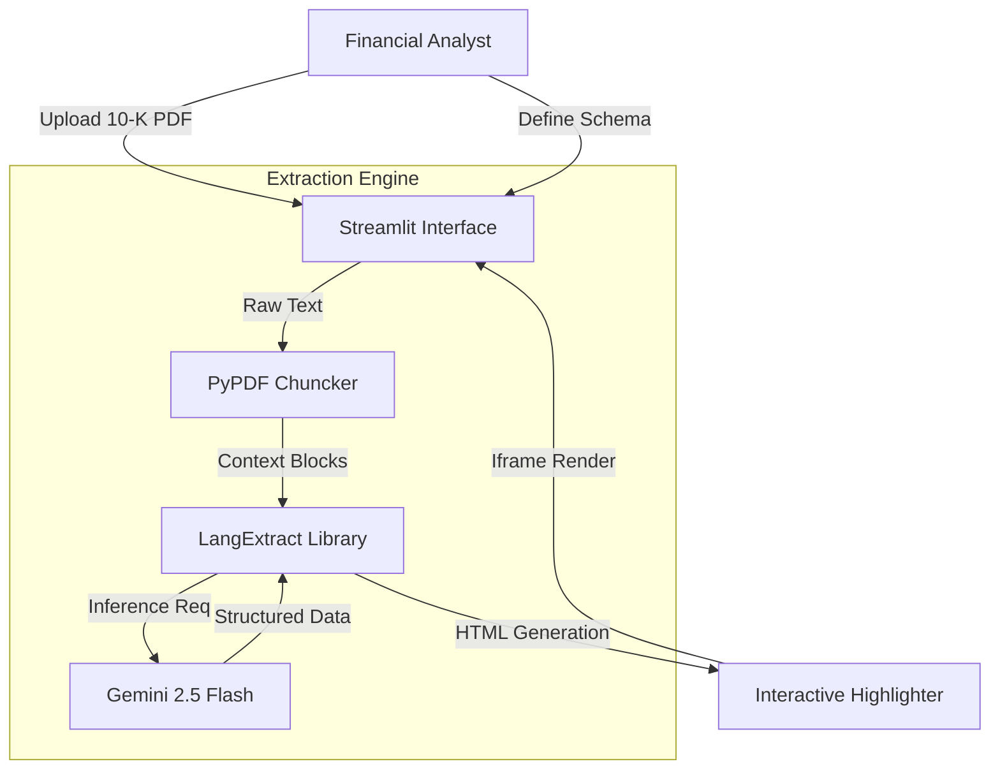

<div align="center">

# DocuTrace: Verifiable AI Auditor
### *Precision Data Extraction with Pixel-Perfect Source Grounding*

[](https://streamlit.io/)
[](https://github.com/google/langextract)
[](https://ai.google.dev/)
[]()

[View Live Demo](https://huggingface.co/spaces/EATosin/DocuTrace-10K-Analyst) • [Engineering Journey](#-engineering-journey-challenges--solutions) • [Architecture](#-system-architecture)

</div>

---

##  Executive Summary
**DocuTrace** is a specialized auditing tool designed for high-stakes domains (Legal, Finance, Compliance) where AI hallucinations are unacceptable.

Unlike standard RAG (Retrieval Augmented Generation) pipelines that summarize text, DocuTrace utilizes **Google's LangExtract** library to perform **Source Grounding**. Every extracted data point is cryptographically linked to its specific coordinates in the source PDF, generating an interactive HTML audit trail.

---

## Engineering Journey: Challenges & Solutions
Building a verifiable extraction engine involves overcoming significant "dependency hell" and rate-limiting barriers.

### 1. The "Slim Image" Dependency Conflict
*   **The Challenge:** We deployed using the standard `python:3.10-slim` Docker image to minimize boot time. However, the `LangExtract` library requires installation directly from GitHub source, which depends on `git`. The build failed with `ExecutableNotFound: git`.
*   **The Solution:** Architected a custom multi-stage Dockerfile that injects system-level dependencies (`apt-get install git`) before the Python environment initializes, ensuring a successful build without bloating the final image.

### 2. The PDF Parsing Bottleneck
*   **The Challenge:** Financial 10-K reports often contain scanned pages or complex layouts that break standard OCR tools.
*   **The Solution:** Implemented a robust `pypdf` pre-processing layer with a "Fail-Fast" mechanism. The system validates text density before passing data to the LLM, preventing wasted API tokens on unreadable files.

### 3. API Rate Limiting (The "Thundering Herd")
*   **The Challenge:** LangExtract is designed for enterprise usage (Vertex AI) and attempts parallel chunk processing. On the Gemini Free Tier, this triggered `429 Resource Exhausted` errors immediately.
*   **The Solution:** Implemented an "Extraction Window" logic in the UI. Users select specific page ranges (e.g., "Risk Factors, Pages 15-20") rather than processing the entire 100-page document at once, keeping the request volume within the 15 RPM limit.

---

## System Architecture



### Core Components
1.  **Frontend (Streamlit):** Handles file ingestion and renders the output within a secure container.
2.  **Intelligence (Gemini 2.5 Flash):** Selected for its 1M token context window, allowing it to hold large document sections in working memory without RAG retrieval loss.
3.  **Grounding (LangExtract):** Maps the LLM's JSON output back to the original PDF text spans using fuzzy matching algorithms.

---

## ⚠️ Limitations & Constraints
This is a production-grade Proof of Concept (PoC) with specific constraints:

*   **Text-Only Extraction:** The current pipeline extracts text. It does not parse charts, graphs, or tables (requires multimodal vision upgrade).
*   **API Quotas:** The Live Demo operates on the Google Gemini Free Tier. Heavy usage may trigger temporary cooldowns (429 Errors).
*   **Session State:** For privacy, all files are processed in ephemeral memory and discarded immediately after the session ends. No data is persisted.

---

## 🚀 Installation & Local Development

### Prerequisites
*   Python 3.10+
*   Google Gemini API Key

### Setup
```bash
# 1. Clone the repository
git clone https://github.com/eatosin/DocuTrace-AI-Auditor.git
cd DocuTrace-AI-Auditor

# 2. Install dependencies (requires Git installed)
pip install -r requirements.txt

# 3. Configure Environment
export GEMINI_API_KEY="your_key_here"

# 4. Run the App
streamlit run app.py
```

---

## Author
**Owadokun Tosin Tobi**
*Senior AI Engineer | Specialist in MLOps & LLM Evaluation*

*   **Portfolio:** [ReasonBench](https://github.com/eatosin/ReasonBench), [Sentinel](https://github.com/eatosin/Sentinel-MLOps)
*   **Connect:** [LinkedIn](https://www.linkedin.com/in/owadokun-tosin-tobi-6159091a3?utm_source=share&utm_campaign=share_via&utm_content=profile&utm_medium=android_app)

---
*Built with Python, Google Cloud AI, and Engineering Rigor.*